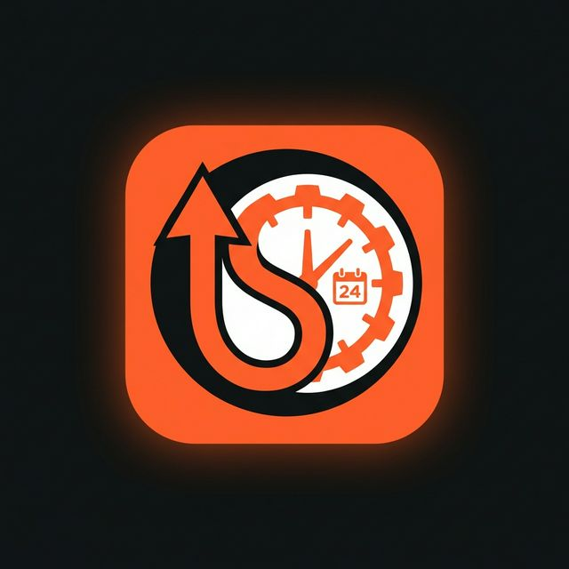

# ShiftUp

<div align="center">
  

  <h3>UK Hospitality Shift Management & Scheduling App</h3>

  <p>
    A comprehensive mobile application for the UK hospitality industry that empowers managers to build rosters and staff to manage their working lives — all from a single, beautifully designed app.
  </p>

  <p>
    
    
    
    
    
  </p>
</div>

---

## Table of Contents

- [Overview](#overview)
- [Features](#features)
- [Architecture](#architecture)
- [Tech Stack](#tech-stack)
- [Project Structure](#project-structure)
- [Prerequisites](#prerequisites)
- [Getting Started](#getting-started)
- [Firebase Configuration](#firebase-configuration)
- [Running Tests](#running-tests)
- [Licenses & Third-Party Packages](#licenses--third-party-packages)
- [Disclaimer](#disclaimer)
- [Author](#author)

---

## Overview

**ShiftUp** is a Flutter mobile application built specifically for the UK hospitality sector. It provides two distinct role-based experiences:

| Role | Description |
|---|---|
| **Manager** | Create and publish rosters, manage staff, approve shift swaps, track clock in/out, view reports |
| **Staff** | View upcoming shifts, clock in/out with geofencing, set availability, request swaps, view pay summaries |

The app is built on a real-time Firebase backend with full offline support via Hive local storage.

---

## Features

### Manager
- 📅 **Roster Management** — Calendar-based shift creation, editing and deletion
- 👥 **Team Overview** — Staff directory with roles, contact info and status
- 🔄 **Shift Swap Approval** — Review and approve/decline staff swap requests
- 📊 **Reports** — Earnings summaries, hours worked, and coverage analytics
- 📲 **Push Notifications** — Real-time alerts for clock-ins, swap requests, and absence

### Staff
- 🏠 **Dashboard** — Active shift card, upcoming shifts, quick actions
- 📋 **My Shifts** — Tabbed upcoming / past shift view with estimated pay
- 👆 **Clock In / Out** — One-tap fingerprint-style clock button with geofence verification
- 🗓️ **Availability** — Tap-to-set calendar indicating available and unavailable days
- 💰 **Pay Summary** — Monthly earnings chart, weekly breakdown, downloadable payslips
- 🔔 **Notifications** — Colour-coded alerts (reminders, swaps, clock confirmations)

---

## Architecture

ShiftUp follows the **MVVM + Repository Pattern** with a feature-first folder structure:

```
Presentation (Screens / Widgets)
      │
      ▼
  ViewModels  ←──  Riverpod StateNotifier Providers
      │
      ▼
  Repository  ←──  Abstracts data sources
      │
  ┌───┴────┐
  │        │
Firebase  Hive
(remote) (local/cache)
```

- **State Management:** Riverpod v2 (`StateNotifierProvider`)
- **Navigation:** GoRouter with `StatefulShellRoute` for role-based tab navigation
- **Data:** Firestore (real-time streams) + Hive (offline cache)

---

## Tech Stack

| Category | Package | Version |
|---|---|---|
| UI Framework | Flutter | 3.x |
| State Management | flutter_riverpod | ^2.5 |
| Navigation | go_router | ^13 |
| Backend | Firebase Auth + Firestore + Storage | Latest |
| Crash Reporting | firebase_crashlytics | ^4.0 |
| Push Notifications | firebase_messaging | ^15 |
| Local Storage | hive_flutter | ^1.1 |
| Charts | fl_chart | ^0.68 |
| Calendar | table_calendar | ^3.1 |
| Animations | flutter_animate | ^4.5 |
| Typography | google_fonts | ^6 |
| QR | qr_flutter + mobile_scanner | Latest |
| Location | geolocator | ^12 |
| Code Generation | build_runner, riverpod_generator | - |

---

## Project Structure

```
shift_up/
├── lib/
│   ├── core/
│   │   ├── constants/       # AppColors, AppSizes
│   │   ├── router/          # GoRouter configuration
│   │   ├── services/        # HiveService
│   │   ├── theme/           # AppTheme (Material 3 dark)
│   │   └── widgets/         # AppButton, AppTextField
│   ├── features/
│   │   ├── auth/            # Login, Register, Splash + AuthViewModel
│   │   ├── manager/         # Dashboard, Roster, Shell
│   │   ├── staff/           # Dashboard, Shifts, Clock, Availability, Pay
│   │   └── shared/          # ShiftModel, NotificationModel, repositories
│   └── main.dart
├── test/
│   ├── unit/                # Model + ViewModel unit tests
│   └── widget/              # Screen widget tests
└── pubspec.yaml
```

---

## Prerequisites

Ensure the following are installed before cloning:

| Tool | Minimum Version | Install |
|---|---|---|
| Flutter SDK | 3.19.0+ | [flutter.dev/install](https://docs.flutter.dev/get-started/install) |
| Dart SDK | 3.3.0+ | Bundled with Flutter |
| Xcode (iOS/macOS) | 15+ | Mac App Store |
| Android Studio | 2023+ | [developer.android.com](https://developer.android.com/studio) |
| Firebase CLI | Latest | `npm install -g firebase-tools` |
| FlutterFire CLI | Latest | `dart pub global activate flutterfire_cli` |

---

## Getting Started

### 1. Clone the repository

```bash
git clone https://github.com/georgeikwegbu/shift_up.git
cd shift_up
```

### 2. Install dependencies

```bash
flutter pub get
```

### 3. Configure Firebase (see [Firebase Configuration](#firebase-configuration))

### 4. Create required asset directories

```bash
mkdir -p assets/images assets/icons assets/animations assets/fonts
```

> **Note:** Font files (PlusJakartaSans) are loaded via `google_fonts` at runtime, so no manual font installation is required.

### 5. Run the app

```bash
# Development (debug)
flutter run

# Target a specific device
flutter run -d <device-id>

# List available devices
flutter devices
```

### 6. Build for production

```bash
# Android APK
flutter build apk --release

# Android App Bundle (Play Store)
flutter build appbundle --release

# iOS (requires macOS + Xcode)
flutter build ios --release
```

---

## Firebase Configuration

ShiftUp requires a Firebase project with the following services enabled:

- **Authentication** — Email/Password sign-in
- **Cloud Firestore** — Primary database
- **Firebase Storage** — Profile avatars
- **Firebase Cloud Messaging** — Push notifications

### Steps

```bash
# 1. Log in to Firebase
firebase login

# 2. From the project root, run FlutterFire configure
flutterfire configure

# This will generate:
# - android/app/google-services.json
# - ios/Runner/GoogleService-Info.plist
# - lib/firebase_options.dart  (optional, for multi-platform)
```

> ⚠️ **Never commit** `google-services.json`, `GoogleService-Info.plist` or `firebase_options.dart` to version control. They are listed in `.gitignore`.

### Required Firestore Collections

| Collection | Description |
|---|---|
| `users` | User profiles (role, venue, hourly rate) |
| `shifts` | Shift records (staff assignments, clock in/out) |
| `notifications` | User notification records |
| `venues` | Venue/location records |

### Recommended Firestore Security Rules (starter)

```javascript
rules_version = '2';
service cloud.firestore {
  match /databases/{database}/documents {
    match /users/{userId} {
      allow read, write: if request.auth != null && request.auth.uid == userId;
    }
    match /shifts/{shiftId} {
      allow read: if request.auth != null;
      allow write: if request.auth != null;
    }
  }
}
```

---

## Running Tests

```bash
# Run all tests
flutter test

# Run only unit tests
flutter test test/unit/

# Run only widget tests
flutter test test/widget/

# Run with coverage
flutter test --coverage
genhtml coverage/lcov.info -o coverage/html
open coverage/html/index.html

# Run a specific test file
flutter test test/unit/models_test.dart
```

### Test Coverage

| Test File | What It Tests |
|---|---|
| `test/unit/models_test.dart` | `UserModel` & `ShiftModel` — fromMap, toMap, computed properties, copyWith |
| `test/unit/auth_view_model_test.dart` | `AuthState` + `AuthViewModel` — all state transitions, error parsing |
| `test/widget/auth_screens_test.dart` | `LoginScreen` & `RegisterScreen` — rendering, validation, loading states |

---

## Licenses & Third-Party Packages

This project makes use of the following open-source packages, each governed by their respective licenses:

| Package | License |
|---|---|
| `flutter` | BSD 3-Clause |
| `flutter_riverpod` | MIT |
| `go_router` | BSD 3-Clause |
| `firebase_core`, `firebase_auth`, `cloud_firestore`, `firebase_storage`, `firebase_messaging` | Apache 2.0 |
| `hive_flutter` | Apache 2.0 |
| `google_fonts` | Apache 2.0 |
| `fl_chart` | MIT |
| `table_calendar` | Apache 2.0 |
| `flutter_animate` | MIT |
| `intl` | BSD 3-Clause |
| `geolocator` | MIT |
| `mobile_scanner` | MIT |
| `qr_flutter` | BSD 3-Clause |
| `flutter_local_notifications` | BSD 3-Clause |
| `uuid` | MIT |
| `logger` | MIT |
| `permission_handler` | MIT |
| `cached_network_image` | MIT |
| `shimmer` | BSD 3-Clause |
| `lottie` | Apache 2.0 |

Full license texts for all dependencies are available by running:
```bash
flutter pub deps --style=list
```

---

## Disclaimer

> **USE AT YOUR OWN RISK.**
>
> This software is provided "as is", without warranty of any kind, express or implied, including but not limited to the warranties of merchantability, fitness for a particular purpose, and non-infringement.
>
> The author shall not be held liable for any claim, damages, or other liability — whether in an action of contract, tort, or otherwise — arising from, out of, or in connection with the software or the use or other dealings in the software.
>
> By cloning, forking, or otherwise using this codebase, you agree that you are doing so **entirely on your own terms and at your own risk**. The author accepts no legal, financial, or operational responsibility for any outcomes resulting from the use of this software in any environment, including production.
>
> This project is not affiliated with, endorsed by, or sponsored by Flutter, Google, Firebase, or any other third-party service mentioned herein.

---

## Author

**George Ikwegbu**  
Senior Flutter / Mobile Engineer  
🌐 [gikwegbu.netlify.app/](https://gikwegbu.netlify.app/) · 💼 [LinkedIn](https://www.linkedin.com/in/GIkwegbu/) · 🐙 [GitHub](https://github.com/gikwegbu)

---

<div align="center">

Copyright &copy; 2026 George Ikwegbu. All rights reserved.

*Unauthorised copying, modification, or distribution of this software, in whole or in part, is strictly prohibited without the express written permission of the author.*

</div>
